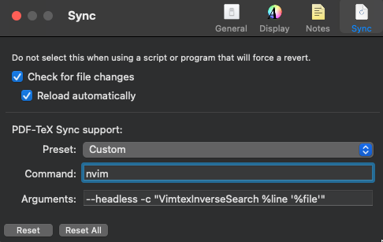

# Linux install

## Install Linux config

```sh
wget -O- https://raw.githubusercontent.com/sokinpui/terminal_dotfiles/refs/heads/main/zsh/setup | bash
```

## After installation, you should...

1. isntall tweaks
2. install extension
3. enable the h.245 video plugins in firefox
4. icons of user
5. web app for Notion and Google Keep
6. Mail setup for CUHK and personal usage
7. dropbox
8. install Google Chrome and Chromium
9. Mouse and trackpad setting
10. keyboard setting: repeate rate
11. Display configuration
12. keyboard shortcut configuration.
13. Onedrive setup

## macOS system preferences after script

1. keyboard shortcut for switching desktop
2. keyboard shortcut for screenshot
3. betterdisplay scaling resolution
4. logioptions+ setting

## logioptions setting

- set mouse scroll direction
- keys mapping
- keys mappping per app
  - chrome: disable the horizontal scroll of switching tabs

5. disable vimimum in overleaf.com to use vim mode in overleaf

6. disable spotlight

```
sudo mdutil -a -i off
```

## raycast

- install google-chrome extension, and use skhd to trigger hotkey

- Last step: restart the computer

# logi mouse config


## vimtex setup with skim

### skim config for inverse/backward search

```
PDF-Tex Sync Support:

Preset: Custom
Command: nvim
Arguments: --headless -c "VimtexInverseSearch %line '%file'"
```


